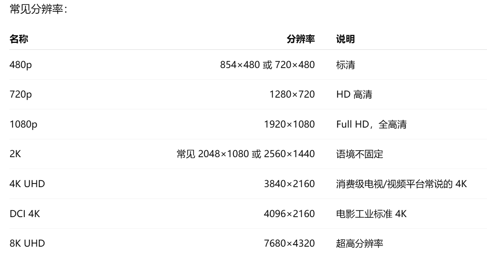
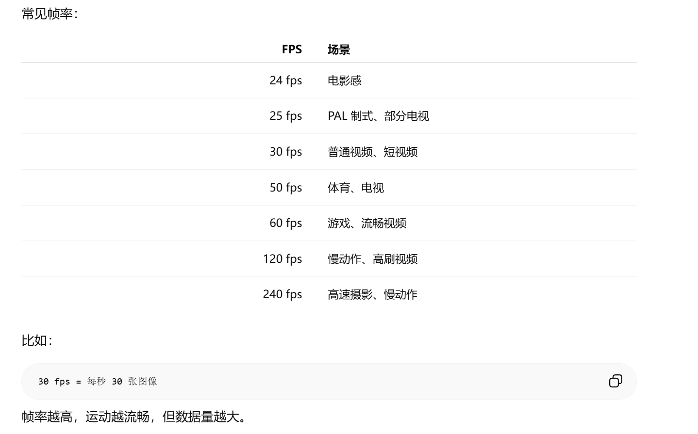

# 视频基础知识

## 1. 分辨率 Resolution

分辨率表示一帧图像有多少像素，格式一般是：

宽 × 高

## 2. 720p / 1080p / 4K 里的 p 是什么意思？

p 表示 progressive scan，逐行扫描。

比如：

1080p = 1920×1080，逐行扫描

与之相对的是 i：

1080i = interlaced scan，隔行扫描

逐行扫描是一帧完整图像；隔行扫描是一帧分成奇数行和偶数行交替显示。现在互联网视频、AI 视频增强基本都处理 progressive 视频，也就是 p。

## 3. 宽高比 Aspect Ratio

宽高比表示画面的形状。

常见有：

宽高比	常见场景
16:9	电视、YouTube、B站、主流横屏视频
9:16	抖音、TikTok、快手竖屏视频
4:3	老电视、老视频
1:1	社交平台方形视频
21:9	电影宽银幕

比如 1920×1080：

1920 / 1080 = 16 / 9

所以它是 16:9。

## 4. 帧 Frame

视频由一张张图片组成，每张图片叫一帧。

第 1 帧
第 2 帧
第 3 帧
...

## 5. 帧率 FPS

FPS 全称是：

Frames Per Second
每秒帧数

表示一秒视频包含多少帧。

## 6. CFR 和 VFR

视频帧率还有两种情况。

CFR：Constant Frame Rate

固定帧率。

每一帧之间时间间隔固定

比如 30fps：

每 1/30 秒一帧

大多数算法训练和推理更喜欢 CFR。

VFR：Variable Frame Rate

可变帧率。

帧与帧之间时间间隔不固定

手机录屏、直播录制、某些剪辑软件导出的视频可能是 VFR。

做视频算法时，如果遇到 VFR，最好先转成 CFR，否则插帧、时序建模、音画同步可能出问题。

## 7. 时间戳 PTS / DTS

视频不是简单按帧顺序播放，还依赖时间戳。

PTS

Presentation Timestamp，显示时间戳。

表示：

这一帧应该在什么时候显示
DTS

Decoding Timestamp，解码时间戳。

表示：

这一帧应该在什么时候被解码

有 B 帧时，解码顺序和显示顺序可能不同，所以 PTS 和 DTS 不一定一样。

视频工程里音画同步、抽帧、重编码经常会遇到 PTS 问题。

## 8. SDR 和 HDR

HDR：High Dynamic Range

HDR 是 高动态范围。

它表示视频能表现更大的亮度范围和更丰富的暗部/高光细节。

普通 SDR 视频：

亮度范围较窄
高光容易死白
暗部容易死黑

HDR 视频：

高光更亮
暗部细节更多
明暗层次更丰富
颜色范围更广

常见 HDR 标准：

标准	说明
HDR10	最常见，静态元数据
HDR10+	动态元数据
Dolby Vision	杜比视界，动态元数据，效果强但授权复杂
HLG	广播电视常用，兼容 SDR 更好

## 9. HRD 是什么？

HRD 全称是：

Hypothetical Reference Decoder
假想参考解码器

这是视频编码标准里的概念，和码流缓冲、码率控制有关。

简单理解：

HRD 用来规定码流不能超过解码器缓冲能力，避免播放器来不及解码或缓冲溢出。

如果你只是做视频增强，HDR 更常见；如果你做视频编码、转码、码率控制，就会遇到 HRD。

## 10. 动态范围 Dynamic Range

动态范围表示：

最暗亮度 到 最亮亮度 的范围

动态范围越大，画面越能同时保留暗部和亮部细节。

比如夜景视频里：

路灯非常亮
街道非常暗

如果动态范围不足：

路灯过曝死白
暗部一片黑

HDR 的核心就是扩大动态范围。

## 11. 位深 Bit Depth

位深表示每个颜色通道能表示多少级。

常见：

位深	每通道级数	说明
8-bit	256 级	普通 SDR 视频常见
10-bit	1024 级	HDR、专业视频常见
12-bit	4096 级	专业制作、RAW 场景

8-bit RGB 每个通道是 0 到 255：

R: 0~255
G: 0~255
B: 0~255

10-bit 每个通道是 0 到 1023。

位深越高，颜色和亮度过渡越平滑，不容易出现色带。

## 12. 色带 Banding

色带是低位深或强压缩时常见问题。

比如天空、墙面、渐变背景，本来应该平滑过渡，但变成一圈一圈的阶梯状。

常见原因：

8-bit 位深不足
码率太低
压缩太强
调色过度
HDR 转 SDR 不当

视频增强中如果做亮度拉伸、低光增强、HDR 映射，很容易把 banding 放大。

## 13. 色彩空间 Color Space

常见色彩空间包括：

RGB
YUV / YCbCr
HSV
Lab

视频编码里最常见的是 YUV / YCbCr。

RGB

RGB 是：

Red
Green
Blue

图像算法里常用 RGB。

YUV / YCbCr

Y 表示亮度，UV 或 CbCr 表示色度。

Y：亮度信息
U/V 或 Cb/Cr：颜色信息

视频编码喜欢 YUV，因为人眼对亮度更敏感，对颜色细节没那么敏感，所以可以压缩色度信息。

## 14. Chroma Subsampling 色度采样

色度采样表示颜色通道被压缩到什么程度。

常见格式：

格式	含义	场景
4:4:4	亮度和色度都完整	专业制作
4:2:2	水平方向色度减半	广播、专业视频
4:2:0	水平和垂直色度都减半	互联网视频最常见

大多数 MP4 视频是：

YUV 4:2:0

这意味着亮度保留完整，但颜色分辨率降低。

做视频增强时，如果你只处理 RGB，需要注意：

解码 YUV → RGB
模型处理 RGB
再编码 RGB → YUV

这个转换过程可能带来色彩变化。

## 15. 色域 Color Gamut

色域表示能表示的颜色范围。

常见标准：

色域	场景
BT.601	标清视频
BT.709	HD / SDR 视频最常见
BT.2020	4K / HDR 常见，色域更广
DCI-P3	电影、部分显示设备

如果把 BT.2020 当 BT.709 播，颜色会不对。
如果 HDR 转 SDR 不处理色域，也会出现偏色或过饱和。

## 17. Tone Mapping 色调映射

Tone Mapping 是把一个亮度范围映射到另一个亮度范围。

最常见：

HDR → SDR

HDR 亮度范围很大，SDR 显示不了那么亮，所以要压缩高光，保留暗部和主体细节。

如果 tone mapping 做不好，会出现：

画面灰
高光死白
暗部死黑
肤色不自然
整体对比度异常

低光增强、HDR 视频增强、曝光修复都会涉及 tone mapping 思想。

## 18. 码率 Bitrate

码率表示视频每秒占用多少数据量。

单位常见：

kbps
Mbps

例如：

5 Mbps = 每秒约 5 megabits 数据

码率越高，通常画质越好，但文件越大、带宽消耗越高。

常见大概范围：

视频	常见码率
720p	1~4 Mbps
1080p	3~8 Mbps
4K	15~50 Mbps
4K HDR	25 Mbps 以上更常见

但码率不能单独决定画质，还要看：

编码器
编码格式
内容复杂度
帧率
分辨率
运动强度

## 19. CBR / VBR / CRF
CBR

Constant Bitrate，恒定码率。

整段视频尽量保持固定码率

适合直播、传输稳定性要求高的场景。

VBR

Variable Bitrate，可变码率。

复杂画面多给码率
简单画面少给码率

适合点播、离线转码，画质和体积平衡更好。

CRF

Constant Rate Factor，恒定质量模式。

常见于 x264/x265 编码。

CRF 越小，质量越高，文件越大
CRF 越大，质量越低，文件越小

例如：

CRF 18：质量高
CRF 23：常用
CRF 28：压缩更强

## 20. 编码 Codec

Codec 是视频编码/解码格式。

常见编码格式：

编码	说明
H.264 / AVC	最常见，兼容性最好
H.265 / HEVC	压缩率比 H.264 更高，4K 常用
AV1	新一代开源编码，压缩效率高
VP9	YouTube 常用过
ProRes	专业剪辑中间格式
DNxHR / DNxHD	专业后期常用
MPEG-2	老电视、DVD 时代
VVC / H.266	更新一代，压缩更强但复杂

常见理解：

H.264：兼容性强
H.265：更省码率，适合 4K
AV1：压缩效率高，但编码更慢
ProRes：文件大，但适合剪辑和后期

## 21. 封装格式 Container

封装格式不是编码格式。

封装格式是一个“容器”，里面可以装：

视频流
音频流
字幕
元数据
时间戳
章节信息

常见封装：

封装	说明
MP4	最常见
MKV	支持格式多
MOV	Apple / 专业后期常见
AVI	老格式
WebM	网页视频常见
TS	直播、流媒体切片常见
FLV	老直播格式

比如一个文件：

video.mp4

它可能里面的视频编码是 H.264，也可能是 H.265。

所以要区分：

MP4 是容器
H.264 是编码

## 22. GOP

GOP 全称：

Group of Pictures
图像组

视频编码不会每一帧都完整保存，而是用帧间预测。

GOP 里常见帧类型：

I 帧
P 帧
B 帧

## 23. I 帧 / P 帧 / B 帧
I 帧

Intra frame，关键帧。

完整保存一帧图像
不依赖其他帧

优点是可以独立解码，缺点是数据量大。

P 帧

Predicted frame，预测帧。

参考前面的帧编码

只保存和前面帧的差异。

B 帧

Bidirectional frame，双向预测帧。

参考前后帧编码

压缩率更高，但解码更复杂，延迟更高。

GOP 结构类似：

I B B P B B P B B I

做视频抽帧、剪辑、转码时，I 帧很重要。

## 24. 关键帧 Keyframe

关键帧一般就是 I 帧。

它的作用：

支持随机访问
支持拖动进度条
支持快速解码起点

关键帧间隔太长：

压缩效率高
但拖动不方便
出错恢复慢

关键帧间隔太短：

文件变大
但剪辑和拖动更方便

## 25. 压缩伪影 Compression Artifacts

视频压缩会带来各种伪影。

常见包括：

Blocking 块效应

画面出现方块状痕迹。

常见于低码率视频。

Ringing 振铃

边缘附近出现波纹或光晕。

常见于强压缩或锐化后。

Mosquito Noise 蚊噪

边缘周围出现细小闪烁噪声。

Banding 色带

平滑渐变区域变成分层。

Blurring 压缩模糊

纹理被抹掉，画面变软。

视频增强和去压缩伪影任务就是要处理这些问题。

## 26. 清晰度 Sharpness

清晰度表示边缘和纹理是否明确。

低清晰度可能来自：

镜头失焦
运动模糊
低分辨率
压缩过强
去噪过度
上采样模糊

注意：

锐化 ≠ 真清晰

过度锐化会产生边缘光晕、假纹理和 ringing。

## 27. 模糊 Blur

视频里常见模糊有几类。

Defocus Blur

失焦模糊。

镜头没有对准主体
Motion Blur

运动模糊。

物体运动太快或快门时间太长
Compression Blur

压缩导致纹理丢失。

Upsampling Blur

低分辨率放大后变糊。

视频去模糊要判断是哪种模糊，因为不同模糊对应不同方法。

## 28. 噪声 Noise

噪声是视频里的随机干扰。

常见于：

低光环境
高 ISO
小传感器
压缩
老视频

常见类型：

亮度噪声
彩色噪声
高斯噪声
泊松噪声
条纹噪声
压缩噪声

低光增强时最容易遇到的问题是：

画面被提亮后，暗部噪声也被放大

所以低光增强通常要结合去噪。

## 29. 闪烁 Flicker

闪烁是视频时间维度的问题。

表现为：

亮度一帧亮一帧暗
颜色跳动
纹理不稳定
增强强度不断变化

常见原因：

曝光自动变化
压缩波动
逐帧增强不一致
去噪/超分逐帧处理
低光增强曲线每帧不同

很多图像增强模型逐帧用于视频时，会产生 flicker。

视频增强模型必须关注时间一致性。

## 30. 鬼影 Ghosting

鬼影是多帧融合或插帧常见问题。

表现为：

运动物体边缘有重影
人手、车轮、头发出现多个位置
背景被拖拽

常见原因：

光流估计错误
帧间对齐不准
遮挡区域处理不好
多帧特征直接平均
插帧运动估计失败

视频超分、去噪、去模糊、插帧都可能出现 ghosting。

## 31. 时序一致性 Temporal Consistency

时序一致性表示相邻帧之间视觉变化是否自然。

好的视频增强应该：

当前帧清楚
下一帧也清楚
纹理不会乱跳
亮度不会闪
颜色不会漂
边缘不会抖

差的时序一致性会导致：

flicker
ghosting
texture dancing
color shift
motion artifacts

视频模型和图像模型最大的区别就在这里：

图像增强只看单帧质量
视频增强还要看帧间稳定性

## 32. 光流 Optical Flow

光流表示像素从一帧移动到下一帧的位移。

例如：

第 t 帧某个像素在 (x, y)
第 t+1 帧移动到 (x+dx, y+dy)
光流 = (dx, dy)

视频增强里光流常用于：

帧间对齐
运动补偿
多帧融合
插帧
视频超分
视频去噪
视频去模糊

常见问题：

大运动难估计
遮挡区域没有对应点
低纹理区域不稳定
模糊视频光流不准
光照变化会影响估计

## 33. Warping

Warping 是根据光流把一帧或特征图对齐到另一帧。

比如：

用光流把前一帧 warp 到当前帧

常见于 BasicVSR、EDVR、RIFE 等模型。

如果光流准：

前后帧可以对齐融合

如果光流不准：

会产生重影、模糊、边缘错位

## 34. 遮挡 Occlusion

遮挡表示某些区域在一帧中可见，在另一帧中不可见。

比如：

人从墙后走出来
车经过遮住背景
镜头移动导致新区域出现

遮挡区域没有可靠的帧间对应关系，所以光流和 warping 很容易失败。

视频插帧、超分、去噪、去模糊都要考虑遮挡。

## 41. 视频质量评价 VQA

VQA 是 Video Quality Assessment。

它要判断：

这个视频质量好不好？

常见指标分三类。

Full-Reference VQA

有参考视频。

原始高质量视频
增强/压缩后视频

对比两者。

常见指标：

PSNR
SSIM
MS-SSIM
VMAF
LPIPS
DISTS
No-Reference VQA

没有参考视频，只看当前视频。

常见模型：

NIQE
BRISQUE
VIDEVAL
RAPIQUE
FAST-VQA
DOVER
KVQ
DAGR-VQA
Subjective VQA

人工主观打分。

常见分数：

MOS：Mean Opinion Score
DMOS：Difference Mean Opinion Score

## 42. PSNR

PSNR 是传统图像/视频质量指标。

它衡量预测图和 GT 的像素误差。

优点：

简单
可解释
常用于论文

缺点：

和人眼感知不一定一致
高 PSNR 可能画面发糊
低 PSNR 可能视觉效果更自然

视频增强不能只看 PSNR。

## 43. SSIM / MS-SSIM

SSIM 衡量结构相似性。

比 PSNR 更接近人眼，但仍然有限。

MS-SSIM 是多尺度 SSIM。

常用于：

压缩评价
超分评价
去噪评价

## 44. LPIPS / DISTS

这类是感知指标，基于深度特征。

它们更关注：

人眼感知差异
纹理
语义结构
视觉自然度

常用于生成式超分、插帧、视频增强评价。

## 45. VMAF

VMAF 是 Netflix 提出的全参考视频质量指标。

它结合多个特征，用学习模型预测主观质量。

常用于：

视频编码
码率控制
转码质量评估
流媒体平台

但 VMAF 也不是万能的。对于 AI 增强、生成式纹理、插帧伪影，VMAF 不一定完全符合人眼。

## 46. UGC

UGC 是：

User Generated Content
用户生成内容

特点：

内容多样
拍摄设备复杂
画质差异大
分辨率混乱
压缩方式不同
有竖屏横屏
有剪辑和滤镜
没有参考视频

UGC-VQA 比传统 VQA 难，因为用户评分会同时受：

技术质量
内容吸引力
构图
语义
平台偏好影响。

## 47. Technical Quality 和 Aesthetic Quality

Technical Quality

技术质量：

清晰度
噪声
模糊
压缩伪影
曝光
颜色
时序稳定性

适合评价增强、压缩、相机、转码。

Aesthetic Quality

美学质量：

内容是否吸引人
构图是否好
主体是否明确
画面是否好看
语义是否有价值

适合内容推荐、视频筛选、短剧质量评价。

视频增强方向更关心 technical quality，但业务系统可能也关心 aesthetic quality。

## 48. 码率-质量权衡 Rate-Distortion

视频系统里经常说 RD：

Rate-Distortion
码率-失真

核心问题是：

用更少码率，获得更高质量

视频压缩、转码、增强都绕不开这个问题。

比如：

同样 1080p 视频
码率 2 Mbps：可能糊、有块效应
码率 8 Mbps：质量更好，但文件更大

AI 增强可以用于：

低码率视频增强
转码后画质恢复
码率节省

## 49. 转码 Transcoding

转码是把视频从一种格式转换成另一种格式。

例如：

H.264 → H.265
4K → 1080p
60fps → 30fps
高码率 → 低码率
HDR → SDR

平台视频通常会生成多档清晰度：

360p
480p
720p
1080p
4K

这叫多码率转码，用于自适应播放。

## 50. ABR 自适应码率

ABR 是 Adaptive Bitrate Streaming。

播放器根据网络情况自动切换清晰度。

比如：

网络好 → 播 1080p
网络差 → 切 480p
网络恢复 → 切回 720p/1080p

常见流媒体协议：

HLS
DASH

视频增强如果接入平台，可能要考虑不同码率档位的增强策略。

## 51. HLS / DASH
HLS

Apple 推出的 HTTP Live Streaming。

常见于直播和点播。

它会把视频切成很多小片段：

segment_001.ts
segment_002.ts
segment_003.ts
...
DASH

Dynamic Adaptive Streaming over HTTP。

也是自适应流媒体标准。

二者都支持多码率播放。

## 52. Latency 延迟

视频系统里延迟很重要。

常见场景：

直播：低延迟很重要
短视频上传处理：可以离线慢一点
视频增强离线处理：可以更慢但质量更高
实时会议：延迟必须很低

视频增强模型通常要权衡：

质量
速度
显存
延迟
稳定性

## 53. Realtime 实时

实时通常指：

处理速度 ≥ 视频播放速度

比如 30fps 视频：

模型每秒至少处理 30 帧

如果处理 1080p 30fps 视频，模型每帧推理时间要小于：

33.3 ms

如果是 60fps：

16.7 ms

视频增强模型很多离线可以跑，实时部署就很难。

## 54. Batch / Clip / Sliding Window

视频模型经常不是一帧一帧处理，而是按 clip 处理。

clip = 一小段连续帧

比如：

输入 5 帧
输入 7 帧
输入 16 帧
输入 32 帧

Sliding Window 是滑动窗口：

处理第 1~7 帧
处理第 2~8 帧
处理第 3~9 帧
...

优点是利用多帧信息，缺点是重复计算多。

## 55. Scene Cut 镜头切换

镜头切换是视频里场景突然变化。

如果算法没有检测镜头切换，可能出问题：

插帧：把两个不同场景混合
视频超分：错误使用前一场景信息
视频去噪：前后帧融合污染
低光增强：时序信息错乱

所以工程视频增强里通常要做 scene cut detection。

## 56. 视频工作里最常用的命令工具：FFmpeg

FFmpeg 是视频处理最常用工具。

常见用途：

查看视频信息
抽帧
合成视频
转码
改分辨率
改帧率
提取音频
合并音频
切片

你至少要会这些概念：

ffprobe：查看视频元信息
ffmpeg -i input.mp4：读取视频
-vf scale：改分辨率
-r：改帧率
-c:v：指定视频编码
-crf：控制质量
-b:v：控制码率
-pix_fmt：指定像素格式

视频算法工程基本离不开 FFmpeg。

## 57. 你现在最应该建立的知识框架

你可以把视频工作理解成这条链路：

视频采集
    ↓
传感器 / ISP / 曝光 / 白平衡
    ↓
原始视频 / RAW / YUV
    ↓
编码压缩
    ↓
传输 / 存储 / 平台转码
    ↓
播放 / 显示
    ↓
用户观看

视频增强可能插入的位置：

采集后增强
压缩前增强
压缩后修复
播放端增强
上传后平台处理
转码链路增强
推荐前质量筛选

## 58. 对你视频增强方向最重要的 20 个关键词

你可以优先记这 20 个：

1. Resolution 分辨率
2. FPS 帧率
3. Bitrate 码率
4. Codec 编码
5. Container 封装
6. GOP
7. I/P/B frames
8. YUV / RGB
9. Chroma Subsampling
10. Bit Depth
11. Color Gamut
12. SDR / HDR
13. Tone Mapping
14. Compression Artifacts
15. Optical Flow
16. Warping
17. Temporal Consistency
18. Flicker
19. Ghosting
20. VQA

## 59. 面试/工作中可以这样总结

你可以这样说：

视频相关工作不仅要理解单帧图像，还要理解时间维度、编码压缩、色彩体系和主观质量。视频的基础属性包括分辨率、帧率、码率、编码格式、色彩空间、位深、动态范围和封装格式。视频增强任务通常围绕超分、去噪、去模糊、低照度增强、去压缩伪影和插帧展开。相比图像增强，视频增强最大的难点是时序一致性，需要处理光流对齐、遮挡、镜头切换、闪烁、鬼影和运动伪影。同时，工程落地还要关注编码压缩、码率控制、推理速度、延迟、显存和 VQA 质量评价指标。